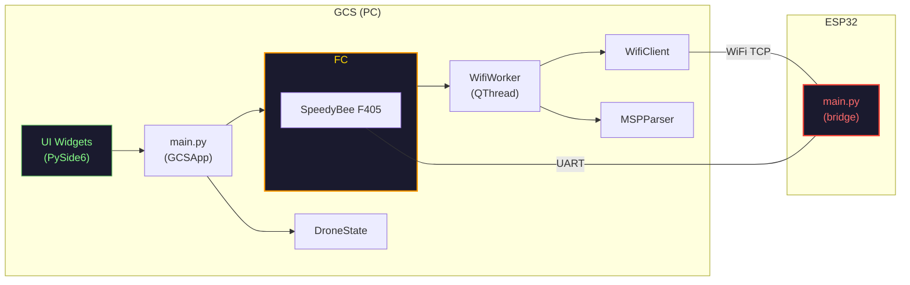

# 📋 Implementation Plan — Drone GCS Bug Fix

> Tổng hợp tất cả lỗi từ 3 phiên phân tích + 1 lỗi người dùng báo cáo  
> Ngày: 2026-04-08 | Tổng: **22 bugs** | Ước tính: **~6 giờ**

---

## Tổng Quan Kiến Trúc



---

## PHASE 0 — KHẨN CẤP (Phải fix TRƯỚC khi bay)

> [!CAUTION]
> Các lỗi trong phase này ảnh hưởng trực tiếp đến an toàn bay. **Không được bay thật** khi chưa fix xong Phase 0.

---

### TASK-01: 🔴 Emergency Overlay — Nút DISARM & Safe Land Không Hoạt Động Khi Takeoff

- **Nguồn**: Bug người dùng báo cáo trực tiếp
- **Files**: [emergency_overlay.py](file:///d:/Test_Drone/ui/emergency_overlay.py), [main.py](file:///d:/Test_Drone/main.py), [flight_controller.py](file:///d:/Test_Drone/core/flight_controller.py)
- **Triệu chứng**: Click nút ⛔ DISARM và 🛬 Safe Land trên Emergency Overlay khi drone đang Takeoff → drone không phản ứng

#### Phân tích nguyên nhân gốc (Root Cause: 2 lỗi chồng chéo)

**Lỗi 1 — `QGraphicsOpacityEffect` chặn click event trên widget con:**

```python
# emergency_overlay.py line 50-52
self._opacity_effect = QGraphicsOpacityEffect(self)   # Gắn lên TOÀN BỘ overlay
self._opacity_effect.setOpacity(0.0)
self.setGraphicsEffect(self._opacity_effect)           # ← BUG!
```

`QGraphicsOpacityEffect` khi gắn lên **parent widget** sẽ render toàn bộ widget (bao gồm children) thành 1 image rồi áp opacity. Kết quả: **các nút con (QPushButton) mất khả năng nhận mouse event** trong một số trường hợp, đặc biệt khi opacity < 1.0. Đây là [Qt known issue](https://bugreports.qt.io/browse/QTBUG-white) — `setGraphicsEffect()` trên parent có thể can thiệp vào `mousePressEvent` của children.

**Lỗi 2 — State machine `_tick()` ghi đè lệnh DISARM mỗi 100ms:**

```python
# Khi đang ở state THROTTLE_RAMP:
def _handle_throttle_ramp(self):
    self._channels[self.CH_THROTTLE] = min(...)  # Tăng ga
    self._send_rc()  # → Gửi AUX1=ARM mỗi 100ms ← GHI ĐÈ
```

Ngay cả khi `disarm()` gửi thành công 1 frame DISARM, nếu timer `_tick()` chạy **ngay sau đó** (100ms) → nó ghi đè lại `_channels` và gửi lại AUX1=ARM → FC nhận ARM liên tiếp → drone vẫn ARM.

`disarm()` có gọi `self._timer.stop()` — nên LÝ THUYẾT timer ngưng. Nhưng nếu `_tick()` đã được Qt event queue dispatch trước khi `stop()` có hiệu lực, sẽ bị race condition trên event queue.

Tuy nhiên, **lỗi 1 (opacity effect)** là nguyên nhân chính: nút bấm **không nhận click event nào cả** → `_emergency_disarm()` **không bao giờ được gọi**.

#### Cách fix

**Fix 1 — Bỏ `QGraphicsOpacityEffect` trên parent, dùng stylesheet opacity thay thế:**
```python
# emergency_overlay.py — Thay đổi approach
# TRƯỚC:
self._opacity_effect = QGraphicsOpacityEffect(self)
self.setGraphicsEffect(self._opacity_effect)

# SAU: Dùng stylesheet rgba + show/hide thông thường
# Không cần opacity effect → nút luôn nhận click
```

Hoặc nếu muốn giữ animation, gắn `QGraphicsOpacityEffect` lên **từng element** riêng (label) nhưng **KHÔNG gắn lên parent widget**. Các nút emergency giữ nguyên không có effect.

**Fix 2 — Thêm guard trong `_tick()` để tôn trọng lệnh abort/disarm:**
```python
def _tick(self):
    if self._state == "IDLE":
        self._timer.stop()
        return  # Không làm gì thêm
    # ... xử lý state bình thường
```

**Fix 3 — `_emergency_disarm()` gọi `abort()` thay vì `disarm()`** (abort mạnh hơn — force dừng ngay):
```python
def _emergency_disarm(self):
    self.flight_controller.abort()  # Dùng abort() thay vì disarm()
    self.emergency_overlay.hide_overlay()
```

- **Thời gian**: ~45 phút
- **Test**: Mock mode → Takeoff → Click DISARM/Safe Land → Verify drone phản hồi

---

### TASK-02: 🔴 ESP32 Failsafe Chỉ Gửi 1 Frame RTH Rồi Ngưng

- **Nguồn**: Phiên phân tích 1 + 3
- **File**: [ESP32/main.py:287-303](file:///d:/Test_Drone/ESP32/main.py#L287-L303)
- **Nguyên nhân**: Khi failsafe kích hoạt, code gửi 1 frame RTH → `conn.close()` → `conn = None` → vòng lặp rơi vào nhánh `if conn is None` → block gửi RC liên tục (line 294-303) nằm trong nhánh `else` → **chết hoàn toàn**

#### Cách fix
- Di chuyển logic gửi RC failsafe liên tục vào **đầu nhánh `if conn is None`**
- Thêm xả UART buffer khi `conn is None`
- Tham chiếu: [ESP32/main_fixed.py](file:///d:/Test_Drone/ESP32/main_fixed.py) đã có bản sửa

- **Thời gian**: ~30 phút
- **Test**: Ngắt WiFi giữa chuyến bay mock → Verify UART vẫn gửi RC liên tục

---

### TASK-03: 🔴 ESP32 CPU 100% Busy Loop — Không Có sleep()

- **Nguồn**: Phiên phân tích 3
- **File**: [ESP32/main.py:218](file:///d:/Test_Drone/ESP32/main.py#L218)
- **Nguyên nhân**: `while True` không có `time.sleep_ms()` ở bất kỳ nhánh nào

#### Cách fix
- `time.sleep_ms(10)` khi `conn is None`
- `time.sleep_ms(1)` khi đang xử lý data (cuối nhánh `else`)
- Tham chiếu: [ESP32/main_fixed.py](file:///d:/Test_Drone/ESP32/main_fixed.py)

- **Thời gian**: ~5 phút

---

## PHASE 1 — ESP32 Firmware Stability

> [!IMPORTANT]
> Phase 1 giải quyết tất cả bug còn lại trên ESP32. Sau Phase 1, có thể thay thế `ESP32/main.py` bằng `ESP32/main_fixed.py`.

---

### TASK-04: 🟡 Socket Không Close Khi PC Ngắt Bình Thường

- **Nguồn**: Phiên phân tích 3
- **File**: [ESP32/main.py:237-256](file:///d:/Test_Drone/ESP32/main.py#L237-L256)
- **Fix**: Khi `recv()` trả `b''` → close socket ngay, set `conn = None`, dùng `continue`
- **Thời gian**: ~10 phút

### TASK-05: 🟡 TCP Stream Ghép Lệnh FS: Vào MSP Data

- **Nguồn**: Phiên phân tích 1 + 3
- **File**: [ESP32/main.py:241-245](file:///d:/Test_Drone/ESP32/main.py#L241-L245)
- **Fix**: Dùng `data.find(FS_PREFIX)` thay vì `data.startswith(FS_PREFIX)` để tách FS config khỏi chunk MSP
- **Thời gian**: ~15 phút

### TASK-06: 🟡 Memory Leak — `build_msp_set_raw_rc()` Tạo Rác

- **Nguồn**: Phiên phân tích 3
- **File**: [ESP32/main.py:83-126](file:///d:/Test_Drone/ESP32/main.py#L83-L126)
- **Fix**: Pre-allocate `bytearray(22)`, dùng `struct.pack_into()`, dùng tuple hằng cho failsafe channels
- **Thời gian**: ~20 phút

### TASK-07: 🟢 Thêm Hardware Watchdog Timer

- **Nguồn**: Phiên phân tích 3
- **File**: [ESP32/main.py](file:///d:/Test_Drone/ESP32/main.py) (thêm mới)
- **Fix**: `from machine import WDT; wdt = WDT(timeout=5000); wdt.feed()` mỗi vòng lặp
- **Thời gian**: ~5 phút

### TASK-08: 🟢 Sửa Comment Thứ Tự Kênh (AERT → AETR)

- **Nguồn**: Phiên phân tích 1 + 2
- **Files**: [ESP32/main.py:54](file:///d:/Test_Drone/ESP32/main.py#L54), [ESP32/main.py:141-149](file:///d:/Test_Drone/ESP32/main.py#L141-L149), [ESP32/main.py:166-174](file:///d:/Test_Drone/ESP32/main.py#L166-L174)
- **Fix**: Thay `[Roll, Pitch, Yaw, Throttle, ...]` → `[Roll, Pitch, Throttle, Yaw, ...]`
- **Thời gian**: ~5 phút

> [!TIP]
> Tất cả TASK-02 đến TASK-08 đã có bản sửa hoàn chỉnh trong [ESP32/main_fixed.py](file:///d:/Test_Drone/ESP32/main_fixed.py). Có thể review + rename thành `main.py` sau khi kiểm tra.

---

## PHASE 2 — GCS Communication Layer

---

### TASK-09: 🟡 WifiWorker.stop() Race Condition — Đóng Socket Từ Sai Thread

- **Nguồn**: Phiên phân tích 3
- **File**: [wifi_worker.py:318-324](file:///d:/Test_Drone/comm/wifi_worker.py#L318-L324)
- **Fix**: `stop()` chỉ set `is_running = False`, gọi `self.wait(2000)` chờ thread tự dọn dẹp trong `finally` block
- **Thời gian**: ~10 phút

### TASK-10: 🟡 Command Queue Không Giới Hạn + Burst Drain

- **Nguồn**: Phiên phân tích 3
- **File**: [wifi_worker.py:71](file:///d:/Test_Drone/comm/wifi_worker.py#L71), [wifi_worker.py:163-171](file:///d:/Test_Drone/comm/wifi_worker.py#L163-L171)
- **Fix**:
  - Queue `maxsize=10`, bỏ lệnh cũ nhất khi đầy
  - `_drain_command_queue()` giới hạn 2 lệnh/vòng
- **Thời gian**: ~15 phút

### TASK-11: 🟢 Bật TCP_NODELAY Giảm Latency 40ms

- **Nguồn**: Phiên phân tích 3
- **File**: [wifi_client.py:52-54](file:///d:/Test_Drone/comm/wifi_client.py#L52-L54)
- **Fix**: `self._sock.setsockopt(socket.IPPROTO_TCP, socket.TCP_NODELAY, 1)` sau khi tạo socket
- **Thời gian**: ~2 phút

### TASK-12: 🟢 MSP Parser Buffer Vô Hạn

- **Nguồn**: Phiên phân tích 3
- **File**: [msp_parser.py:184](file:///d:/Test_Drone/comm/msp_parser.py#L184)
- **Fix**: Thêm `MAX_BUFFER_SIZE = 4096`, cắt buffer khi vượt ngưỡng
- **Thời gian**: ~5 phút

---

## PHASE 3 — MSP Protocol Hardening

---

### TASK-13: 🟢 `pack_set_raw_rc()` Không Clamp PWM 1000-2000

- **Nguồn**: Phiên phân tích 2
- **File**: [msp_parser.py:102-118](file:///d:/Test_Drone/comm/msp_parser.py#L102-L118)
- **Fix**: Thêm `clamped = [max(1000, min(2000, ch)) for ch in channels]` trước `struct.pack`
- **Thời gian**: ~5 phút
- **Test**: Chạy `pytest tests/test_aux_modes.py` — bỏ comment test clamp

### TASK-14: 🟢 `_send_rc()` Bypass `pack_set_raw_rc()` Validation

- **Nguồn**: Phiên phân tích 2
- **File**: [flight_controller.py:594-600](file:///d:/Test_Drone/core/flight_controller.py#L594-L600)
- **Fix**: Đổi thành gọi `self._parser.pack_set_raw_rc(self._channels)` thay vì tự pack
- **Thời gian**: ~5 phút

### TASK-15: 🟢 Sửa Comment Sai Trong MSP Parser

- **Nguồn**: Phiên phân tích 2
- **Files**:
  - [msp_parser.py:106](file:///d:/Test_Drone/comm/msp_parser.py#L106): Channel order comment (AERT → AETR)
  - [msp_parser.py:135](file:///d:/Test_Drone/comm/msp_parser.py#L135): WP flag (`0x48` → `0xA5`)
  - [msp_parser.py:144](file:///d:/Test_Drone/comm/msp_parser.py#L144): Payload size (`21 bytes` → `19 bytes`)
- **Thời gian**: ~5 phút

---

## PHASE 4 — Data Structures & UX

---

### TASK-16: 🟡 Home Position Chốt Trên GPS Data Stale

- **Nguồn**: Phiên phân tích 3
- **File**: [main.py:409-416](file:///d:/Test_Drone/main.py#L409-L416)
- **Fix**: Thêm `and self.drone_state.gps_fix_type >= 2` (3D fix) trước khi chốt Home
- **Thời gian**: ~5 phút

### TASK-17: 🟡 `DroneState.reset()` Dùng Pattern `self.__init__()` Nguy Hiểm

- **Nguồn**: Phiên phân tích 3
- **File**: [drone_state.py:64-66](file:///d:/Test_Drone/core/drone_state.py#L64-L66)
- **Fix**: Viết reset thủ công từng field, dùng `self.motors[:] = [...]` in-place
- **Thời gian**: ~10 phút

### TASK-18: 🟡 Nút Send Manual Không Kết Nối → Không Hoạt Động

- **Nguồn**: Phiên phân tích 2
- **Files**: [manual_control_tab.py](file:///d:/Test_Drone/ui/manual_control_tab.py), [main.py](file:///d:/Test_Drone/main.py)
- **Fix**: Thêm handler `_send_manual_rc()` trong main.py, kết nối `mc.btn_send_manual.clicked`
- **Thời gian**: ~20 phút

### TASK-19: 🟡 Nút HOLD Không Kết Nối → Không Hoạt Động

- **Nguồn**: Phiên phân tích 2
- **Files**: [manual_control_tab.py](file:///d:/Test_Drone/ui/manual_control_tab.py), [main.py](file:///d:/Test_Drone/main.py)
- **Fix**: Kết nối `mc.btn_hold.clicked` với handler thích hợp (ALTHOLD+POSHOLD)
- **Thời gian**: ~10 phút

### TASK-20: 🟢 Thiếu Slider AUX3, AUX4 Trong Manual Control

- **Nguồn**: Phiên phân tích 2
- **File**: [manual_control_tab.py](file:///d:/Test_Drone/ui/manual_control_tab.py)
- **Fix**: Thêm 2 slider cho AUX3 (Safe Land) và AUX4 (RTH)
- **Thời gian**: ~15 phút

### TASK-21: 🟢 WiFi Password Yếu Trên ESP32

- **Nguồn**: Phiên phân tích 3
- **File**: [ESP32/main.py:18](file:///d:/Test_Drone/ESP32/main.py#L18)
- **Fix**: Đổi password mạnh hơn + `authmode=4` (WPA2_PSK)
- **Thời gian**: ~2 phút

### TASK-22: 🟢 `hide_overlay()` Memory Leak — `finished.connect` Tích Lũy

- **Nguồn**: Phát hiện khi phân tích TASK-01
- **File**: [emergency_overlay.py:177](file:///d:/Test_Drone/ui/emergency_overlay.py#L177)
- **Fix**: `self._fade_anim.finished.connect(self._on_fade_out_done)` được gọi MỖI LẦN `hide_overlay()` → tích lũy connections. Phải disconnect trước hoặc dùng `connect` 1 lần trong `__init__`
- **Thời gian**: ~5 phút

---

## Bảng Tổng Hợp

```mermaid
gantt
    title Fix Plan Timeline
    dateFormat HH:mm
    axisFormat %H:%M

    section Phase 0 - Khẩn cấp
    TASK-01 Emergency Overlay     :crit, t01, 00:00, 45min
    TASK-02 ESP32 Failsafe Loop   :crit, t02, after t01, 30min
    TASK-03 ESP32 CPU Sleep       :crit, t03, after t02, 5min

    section Phase 1 - ESP32
    TASK-04 Socket Cleanup        :t04, after t03, 10min
    TASK-05 FS Config Parse       :t05, after t04, 15min
    TASK-06 Zero-alloc MSP        :t06, after t05, 20min
    TASK-07 Hardware WDT          :t07, after t06, 5min
    TASK-08 Channel Comments      :t08, after t07, 5min

    section Phase 2 - GCS Comm
    TASK-09 Thread-safe Stop      :t09, after t08, 10min
    TASK-10 Queue Limits          :t10, after t09, 15min
    TASK-11 TCP_NODELAY           :t11, after t10, 2min
    TASK-12 Buffer Limit          :t12, after t11, 5min

    section Phase 3 - MSP
    TASK-13 PWM Clamp             :t13, after t12, 5min
    TASK-14 _send_rc Validation   :t14, after t13, 5min
    TASK-15 Comment Fixes         :t15, after t14, 5min

    section Phase 4 - Data & UX
    TASK-16 Home GPS Fix          :t16, after t15, 5min
    TASK-17 DroneState Reset      :t17, after t16, 10min
    TASK-18 Send Manual Button    :t18, after t17, 20min
    TASK-19 Hold Button           :t19, after t18, 10min
    TASK-20 AUX3/4 Sliders        :t20, after t19, 15min
    TASK-21 WiFi Password         :t21, after t20, 2min
    TASK-22 Overlay Signal Leak   :t22, after t21, 5min
```



| Phase | Tasks | Mức độ | Tổng thời gian |
|-------|-------|--------|----------------|
| **Phase 0** | TASK-01, 02, 03 | 🔴 CRITICAL | ~80 phút |
| **Phase 1** | TASK-04 → 08 | 🟡 HIGH | ~55 phút |
| **Phase 2** | TASK-09 → 12 | 🟡 HIGH + 🟢 MEDIUM | ~32 phút |
| **Phase 3** | TASK-13 → 15 | 🟢 MEDIUM | ~15 phút |
| **Phase 4** | TASK-16 → 22 | 🟡/🟢 MIXED | ~67 phút |
| **Tổng** | 22 tasks | — | **~4.2 giờ** |

---

## Checklist Kiểm Thử Sau Fix

- [ ] **Mock Test**: Takeoff → Click DISARM/Safe Land → Drone phản hồi dừng lại
- [ ] **Mock Test**: ARM → Emergency Overlay hiện → Nút click được
- [ ] **Unit Test**: `pytest tests/test_aux_modes.py -v` → 12/12 passed
- [ ] **ESP32 Test**: Ngắt WiFi giữa bay → UART vẫn gửi RTH liên tục (verify bằng Serial Monitor)
- [ ] **ESP32 Test**: Reconnect sau failsafe → `failsafe_triggered = False` reset đúng
- [ ] **Latency Test**: Đo round-trip GCS → ESP32 → FC trước/sau TCP_NODELAY

> [!WARNING]
> **Luôn test với cánh quạt tháo rời** khi kiểm tra ARM/DISARM/Takeoff trên phần cứng thật!
